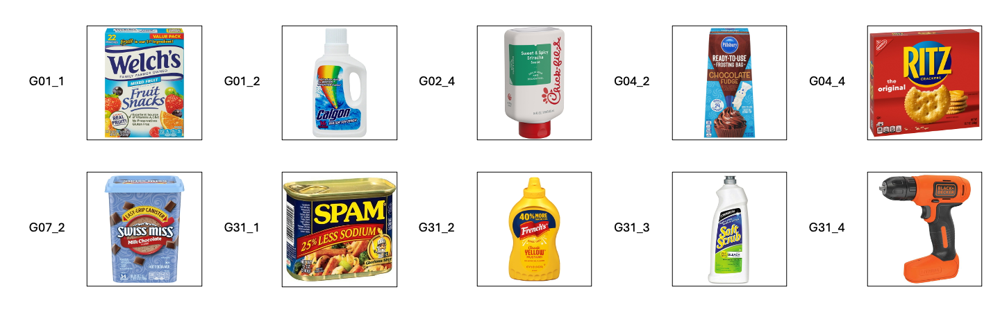

# Summer Camp

**Contents**

- [Summer Camp](#summer-camp)
  - [Introduction](#introduction)
  - [Environment Setup](#environment-setup)
    - [Install Git](#install-git)
    - [Install the Code Editor (VSCode for example)](#install-the-code-editor-vscode-for-example)
    - [Clone the Repository](#clone-the-repository)
    - [Python Environment Setup](#python-environment-setup)
  - [Project Schedule](#project-schedule)
    - [Week 1: Introduction to the Basics](#week-1-introduction-to-the-basics)
    - [Week 2: Data Collection](#week-2-data-collection)
    - [Week 3: Scripts Preparation](#week-3-scripts-preparation)
    - [Week 4: Data Processing](#week-4-data-processing)
  - [Data Collection](#data-collection)

## Introduction

This is the repository for the Summer Camp project. The project aims to estimate the hand and object poses from the recordings captured by the Multi-Camera System. 

## Environment Setup

  ### Install Git

  - Linux

    ```bash
    sudo apt-get install git
    ```

  - Windows

    I suguest to use [Github Desktop](https://desktop.github.com/), which is more user-friendly. Otherwise, you could install git via [Git for Windows](https://gitforwindows.org/).

  - MacOS

    You can install git either via [Homebrew](https://brew.sh/), or [Github Desktop](https://desktop.github.com/).

    - Homebrew
      ```bash
      /bin/bash -c "$(curl -fsSL https://raw.githubusercontent.com/Homebrew/install/HEAD/install.sh)"
      ```

  ### Install the Code Editor (VSCode for example)

  - You could install the Visual Studio Code (VSCode) from the [official website](https://code.visualstudio.com/).
  - Once you have installed the VSCode, you could install below extensions:
    - [Python](https://marketplace.visualstudio.com/items?itemName=ms-python.python)
    - [Pylance](https://marketplace.visualstudio.com/items?itemName=ms-python.vscode-pylance)
    - [Python Debugger](https://marketplace.visualstudio.com/items?itemName=ms-python.debugpy)
    - [Jupyter](https://marketplace.visualstudio.com/items?itemName=ms-toolsai.jupyter)
    - [Black Formatter](https://marketplace.visualstudio.com/items?itemName=ms-python.black-formatter)


  ### Clone the Repository
  
  ```bash
  git clone https://github.com/gobanana520/summer_camp.git summer_camp
  ```

  ### Python Environment Setup

  Follow steps in the [Python Environment Setup](./docs/Python_Environment_Setup.md) document to setup your Python environment.

---

## Project Schedule

### Week 1: Introduction to the Basics
- :white_check_mark: [Pythion Basics](./notebooks/01_Python_Basics.ipynb)
  Try to understand basics in Python, such as list, tuple, set, dictionary, class, function, loop, etc.

- :white_check_mark: [Numpy Basics](./notebooks/02_Python_Numpy.ipynb)
  Try to understand basics in Numpy, such as array, matrix, operation, etc.

- :white_check_mark: [Pytorch Basics](./notebooks/06-1_Pytorch_Basics.ipynb)
  Try to understand basics in Pytorch, such as tensor, operation, etc.
- :white_check_mark: [ComputerVisionBasics](./docs/slides/01_ComputerVisionBasics.pdf)
  - Practice 1: [Transformation](./notebooks/03-3_CV_Transformation.ipynb)
    How to apply the transformation to 3D points.
  - Practice 2: [Deprojection](./notebooks/03-1_CV_Deprojection.ipynb)
    How to depreject the 2D image points to 3D camera points.
  - Practice 3: [Triangulation](./notebooks/03-2_CV_Triangulation.ipynb)
    How to calculate the 3D world points from 2D image points.
  - Homework 1: [SequenceLoader](./notebooks/hw1_SequenceLoader.ipynb)
    Write a class to load the data from sequence recording.
- :white_check_mark: [Introduction_to_ROS](./docs/slides/02_Introduction_to_ROS.pdf)
  Understand the basic concepts and useful commands in ROS.
- :white_check_mark: [Introduction_to_MANO](./docs/slides/03_Introduction_to_MANO.pdf)
  Understand the basic concepts of parametric hand model MANO. And introduce the Pytorch implementation of MANO ([Manopth](https://github.com/hassony2/manopth)).
  - Practice 4: [MANO_Hand](./notebooks/05_MANO_Hand.ipynb)
    Understand how to initialize the MANO layer and run the forward process.
- :white_check_mark: [Introduction_to_Optimization](./docs/slides/04_Introduction_to_Optimization.pdf)
  Understand the basic concepts of optimization and the optimization algorithms.
  - Practice 5: [Optimization](./notebooks/06-2_MANO_Pose_Optimization.ipynb)
    Implement the optimization algorithm to optimize the MANO hand pose parameters to fit the target 3D keypoints.
- :books: Readings
  - :point_right: Highlights
    - [RANSAC Algorithm](https://en.wikipedia.org/wiki/Random_sample_consensus)
      - Practice: [RANSAC](./notebooks/04_RANSAC_Algorithm.ipynb)
        A simple implementation of RANSAC algorithm.
    - [SDF (Signed Distance Function)](https://en.wikipedia.org/wiki/Signed_distance_function)
        Understand the basic concept of SDF. We will use SDF loss to optimize the Hand/Object pose.
    - ROS message synchronization & extraction
      - [Export image from rosbag](https://gist.github.com/zxf8665905/2d09d25da823b0f7390cab83c64d631a)
        Understand how to synchronize the messages from different topics, and extract the images. We will write a RosbagExtractor to extract the images from the rosbag recordings.
    - [MediaPipe Handmarks Detection](https://ai.google.dev/edge/mediapipe/solutions/vision/hand_landmarker)
      Understand the MediaPipe Handmarks Detection. We will write the HandmarksDetector to detect the handmarks from the images.
  - Papers (Optional)
    - [SMPL Body Model](./docs/papers/SMPL.pdf)
    - [SMPL-H Body Model](./docs/papers/SMPL-H.pdf)
    - [SMPL-X Body Model](./docs/papers/SMPL-X.pdf)
  - Methods will be used in the project
    - Object Pose Estimation
      - [FoundationPose](https://nvlabs.github.io/FoundationPose)
    - Image Segmentation
      - [Segment Anything](https://github.com/facebookresearch/segment-anything)
    - Video Object Segmentation
      - [XMem](https://hkchengrex.com/XMem)

### Week 2: Data Collection

- Overview of FoundationPose and Segment Anything
  - [FoundationPose](./docs/papers/FoundationPose.pdf)
  - [Segment Anything](./docs/papers/SegmentAnything.pdf)
- :white_check_mark: Camera Calibration for the latest Canera Extrinsics
  
- :white_check_mark: Hand Calibration for each team members.
- Record data with ROS
  - Select the Objects
  - Design the tasks (e.g., pick and place, handover, etc.)
- Extract the images from the rosbag recordings
- **Homeworks**
  - HW1: Rosbag_Extraction
    - Try to write the class `RosbagExtractor` 
      - to extract the images from the rosbag recordings for all the camera image topics.
      - the extracted images should be saved in the `./data/recordings` folder following below structure
        ```
        20231022_193630           # the rosbag name
        ├── 037522251142          # the camera serial number
        │   ├── color_000000.jpg  # the color image color_xxxxxx.jpg
        │   └── depth_000000.png  # the depth image depth_xxxxxx.png
        │   └── ...  
        ├── 043422252387
        │   ├── color_000000.jpg
        │   ├── depth_000000.png
        │   ├── ...
        ├── ...
        ├── 117222250549
        │   ├── color_000000.jpg
        │   ├── depth_000000.png
        │   ├── ...
        ```
    - The recorded rosbag files could be downloaded from [box](https://utdallas.box.com/s/inkzi3td9sfhe4efd9uso5orxolcv03g).
    - If you plan to run the ROS locally, you could follow the [ROS Environment Setup](./docs/ROS_Environment_Setup.md) document to setup the ROS environment with conda. Then you could run the `roscore` to start the ROS master, and debug your code under the ROS environment.
    - References:
      - [Export image from rosbag](https://gist.github.com/zxf8665905/2d09d25da823b0f7390cab83c64d631a)
  - HW2: metadata generation
    - For each extracted recording, the metadata should be generated under the sequence folder named `meta.json`. The metadata should contain the following information:
      ```json
      {
        "serials": [    // the camera serial numbers
          "037522251142",
          "043422252387",
          "046122250168",
          "105322251225",
          "105322251564",
          "108222250342",
          "115422250549",
          "117222250549"
        ],
        "width": 640,
        "height": 480,
        "extrinsics": "extrinsics_20240611",
        "mano_calib": "subject_7",  // the person name
        "object_ids": [ // the object ids in the recording
          "G01_1",
          "G01_2",
          "G01_3"
        ],
        // the hand sides in the recording, if there are two 
        // hands, the right hand should be the first one.
        "mano_sides": [
          "right",
          "left"
        ],
        "num_frames": 100 // the number of frames in the recording
      }
      ```
  - HW3: Handmarks_Detection
    - Try to write the class `HandDetector` to detect the handmarks from the extracted images using the [MediaPipe Handmarks Detection](https://ai.google.dev/edge/mediapipe/solutions/vision/hand_landmarker).
    - The detected handmarks should be saved in the `./data/recordings/<sequence_name>/processed/hand_detection` folder following below structure
      ```
      <sequence_name>/processed/hand_detection
      ├── 037522251142          # the camera serial number
      │   ├── handmarks_000000.npy  # the handmarks file handmarks_xxxxxx.npy
      │   ├── vis_000000.png  # the visualization of the handmarks vis_xxxxxx.png
      │   └── ...  
      ├── 043422252387
      │   ├── handmarks_000000.npy
      │   ├── vis_000000.png
      │   ├── ...
      ├── ...
      ├── 117222250549
      │   ├── handmarks_000000.npy
      │   ├── vis_000000.png
      │   ├── ...
      ```
    - The detected handmarks should be saved as the numpy array with the shape of `(num_hands, num_joints, 2)`.
    - The detected handmarks should be saved in the image coordinate system.
    - The detected handmarks should be saved in the order of the right hand first, and then the left hand.


### Week 3: Scripts Preparation

The reference code for HW1, HW2, and HW3 of week2 could be found in the `./tools` folder.

- :white_check_mark: Collect the data with the Multi-Camera System.
  - One or two hands
  - Single object manipulation
- :white_check_mark: Extract the images from the rosbag recordings.
-  **Before Friday**, finish below homeworks, the extracted recordings could be downloaded from the [Box](https://utdallas.box.com/s/8sczu67ufl2wuirk4c6lyssex2y125fc).
  - HW1: Complete the metadata.
    - Download the recording of your name and unzip it to `./data/recordings`.
    - Complete the `"object_ids"` and `"mano_sides"` information in the `meta.json` file. The `object_id` (G01_1,...,G31_4) could be found in the [Data Collection](#data-collection) section.
  - HW2: Handmarks Detection.
    Run the `./tools/02_run_hand_detector.py` on your recording to detect the handmarks.
  - HW3: Generate the Object Masks for the Objects in each camera view.
    - The `mask_id` (1, 2,...,10) of each object could be found in the [Data Collection](#data-collection) section.
    - Install `timm` via `python pip install --no-cache-dir timm==1.0.3` in case it's not installed in the conda environment.
    - Dwonload the pretrained models [4.3GB] for SAM:
      - For linux like OS: run `bash ./config/sam/download_sam_model.sh` in the terminal.
      - Or you could download the models from the [Box](https://utdallas.box.com/s/ve9ia13act2oos0s6k0mhbx6vhcj19ce) and put them under `./config/sam`.
      - In case your disk space is limited, you could only download the `sam_vit_t.pth` model.
    - Run the `./tools/03_mask_label_toolkit.py` to generate the object masks for the object in each camera view.
      - Click `...` to select the image.
      - `Ctrl + Left Click` to add positive point (green color).
      - `Ctrl + Right Click` to add negative point (red color).
      - `R` to reset the points.
      - Click `-` and `+` to set the mask id, and click `Add Mask` to add the mask.
      - Click `Save Mask` to save the mask.
    
- [Introduction_to_6D_Pose_Estimation](./docs/slides/05_Introduction_to_6D_Pose_Estimation.pdf)
  Understand the basic concepts of 6D Object Pose Estimation and the FoundationPose.
  - :white_check_mark: Setup the python environment for the FoundationPose, and run the demo code successfully.
- [Introduction to the HaMeR](./docs/slides/06_HaMeR.pdf)
  Understand how the HaMeR works and how to use it to estimate the hand shape and pose.
  - :white_check_mark: Setup the python environment for the HaMeR, and run the demo code successfully.
- HW4: Generate the 3D Handmarks by Trangulation and RANSAC
  - Follow the steps in [Generate the 3D Handmarks by Trangulation and RANSAC](./notebooks/07_Generate_3D_Handmarks_by_RANSAC.ipynb) to generate the 3D handmarks.

### Week 4: Data Processing
1. Complete the `meta.json` for all the recordings, refer to HW2 of Week 2.
2. Run **MediaPipe** Handmarks Detection on all the recordings, refer to HW2 of Week 3.
3. Generate the 3D handmarks for all the recordings, refer to HW4 of Week 3.
4. Label the initial object masks for all the recordings, refer to HW3 of Week 3.
5. Generate the object masks for all the recordings by **XMem** by running `./tools/04_run_xmem_segmentation.py`.
6. Run **HaMeR** to estimate the hand pose on our data.
7. Run **FoundationPose** to estimate the object pose on our data.

---

## Data Collection

1. Objects Used in the Dataset
   - The dataset contains the following objects:
     
   - The object models are saved under the `./data/models` folder. You could use [Meshlab](https://www.meshlab.net/) to view the object models.

2. Calibration Information
   - Camera Intrinsics
     The camera intrinsics files are saved under the `./data/calibration/intrinsics` folder.
   - Camera Extrinsics
     The camera extrinsics files are saved under the `./data/calibration/extrinsics` folder.
   - MANO Hand Shapes
     The MANO hand shapes are saved under the `./data/calibration/mano` folder.

3. Rosbag Recordings

   You coud download the rosbag recordings from the [Box](https://utdallas.box.com/s/inkzi3td9sfhe4efd9uso5orxolcv03g).
