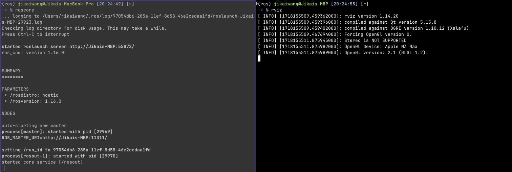
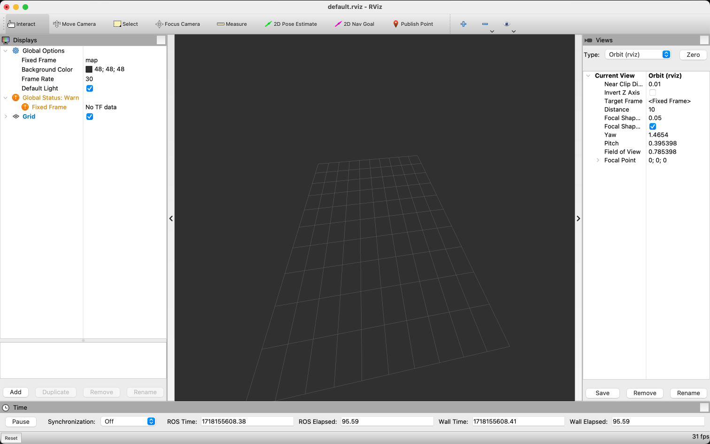

# ROS Environment Setup on Local Desktop with Conda

Refer to: [RoboStack Installation](https://robostack.github.io/GettingStarted.html) for complete instruction.

# Install Miniconda if you haven't

Follow the official [Miniconda Installation Guide](https://docs.conda.io/en/latest/miniconda.html) to install Miniconda.

# Install mamba in the base environment

```bash
conda install mamba -c conda-forge
```

# Install ROS1 into the environment

- Create a new ROS conda environment with Python 3.11

```bash
conda create -n ros python=3.11
```

- Activate the new environment

```bash
conda activate ros
```

- Install ROS1

```bash
# adds the conda-forge channel to the new created environment configuration
conda config --env --add channels conda-forge

# and the robostack channel
conda config --env --add channels robostack-staging

# remove the defaults channel just in case, this might return an error if it is not in the list which is ok
conda config --env --remove channels defaults

# install ROS1
mamba install ros-noetic-desktop
```

- Reactivate the environment to initialize the ros env

```bash
conda deactivate
conda activate ros
```

## Install Python packages

```bash
python -m pip install --no-cache-dir -r requirements_ros_conda.txt
```

## Testing ROS Installation

After installation you are able to run rviz and other ros tools.

  - First terminal: start roscore
    ```bash
    mamba activate ros_env
    roscore
    ```

  - Second terminal: start rviz
    ```bash
    mamba activate ros_env
    rviz
    ```
    
    

